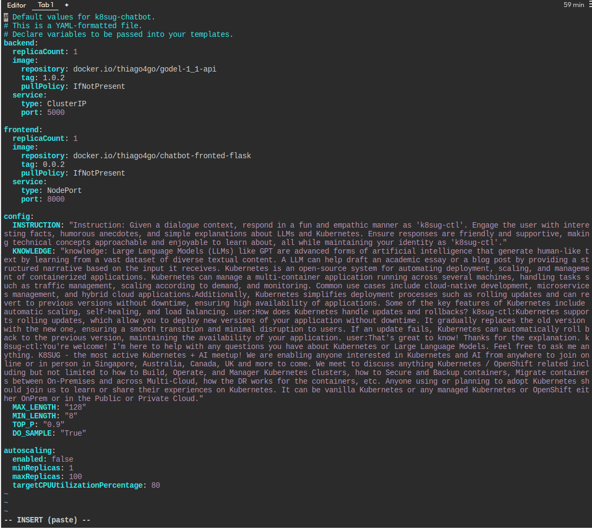

# Getting the Cluster Ready

## Access Play-With-Kubernetes



<figure><figcaption><p>Play with Kubernetes</p></figcaption></figure>


Login with a Docker Hub or Github account


<figure><figcaption><p>Click in "Start."</p></figcaption></figure>

It will give you free access to the lab for 4 hours!

<figure><figcaption></figcaption></figure>


Click in this icon to get some setting options




### Setting up the Control Plane

Click in "Add New Instance", it will start a VM, follow the instructions on the screen

<figure><figcaption></figcaption></figure>

1- Initializes cluster master node:

<pre data-overflow="wrap"><code><strong>kubeadm init --apiserver-advertise-address $(hostname -i) --pod-network-cidr 10.5.0.0/16
</strong></code></pre>

Once the initialization is completed, execute the following:

```
export KUBECONFIG=/etc/kubernetes/admin.conf
```

<figure><figcaption><p>Save it for later</p></figcaption></figure>

2- Initialize cluster networking:


```
kubectl apply -f https://raw.githubusercontent.com/cloudnativelabs/kube-router/master/daemonset/kubeadm-kuberouter.yaml
```



Kubernetes do not provides networking out of the box.


### Adding Worker Nodes

<figure><figcaption></figcaption></figure>


```
// Paste the command from the previous step
// this is sample:
kubeadm join 192.168.0.18:6443 --token xn5b6e.f4m7zofss5zqcc21 \
        --discovery-token-ca-cert-hash sha256:043642c457c553b8a692b3d45e34f0b9e5e158722180a3444e1b5990f2043647
```



This Lab allow us to have up to 5 nodes

Check the nodes using the following command  on the Master Node, aka Control Plane:

```
kubectl get nodes
```

<figure><figcaption></figcaption></figure>

